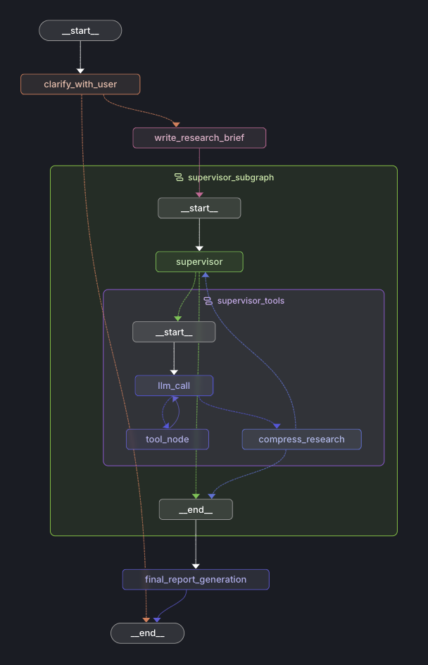

# KEVIN 🔍

> **K**nowledge **E**xtraction and **V**erification **I**ntelligent **N**etwork

A sophisticated LangGraph-based multi-agent deep research system that automates comprehensive research workflows through intelligent agent orchestration.



## ✨ Features

- **Multi-Agent Architecture**: Specialized agents for scoping, research, and report generation
- **Intelligent Research Workflow**: Automated research process from question clarification to final report
- **Advanced Search Integration**: Powered by Tavily search API with content summarization
- **Flexible Model Support**: Configurable OpenAI models through OpenRouter
- **LangGraph Integration**: Built on LangGraph for robust workflow orchestration
- **TypeScript**: Full type safety and modern development experience

## 🏗️ Architecture

KEVIN employs a multi-agent system with specialized roles:

### 🔍 Research Agents

- **Scoping Agent**: Clarifies research questions and defines scope
- **Research Agent**: Conducts deep research using search tools and reflection
- **Multi-Agent Research**: Coordinates multiple research workflows
- **MCP Research Agent**: Integrates with Model Context Protocol for enhanced capabilities

### 🧠 Core Components

- **Search Tools**: Tavily API integration with deduplication and summarization
- **Reflection Tools**: Strategic thinking and progress assessment
- **Compression System**: Intelligent research summarization
- **Report Generation**: Comprehensive final report compilation

## 🚀 Quick Start

### Prerequisites

- Node.js 20+
- Yarn package manager
- OpenAI API key (via OpenRouter)
- Tavily Search API key

### Installation

```bash
# Clone the repository
git clone <repository-url>
cd kevin-odr

# Install dependencies
yarn install

# Set up environment variables
cp .env.example .env
# Edit .env with your API keys
```

### Environment Configuration

Create a `.env` file with the following variables:

```env
OPENAI_API_KEY=your_openrouter_api_key
TAVILY_API_KEY=your_tavily_api_key
```

### Running the System

```bash
# Build the project
yarn build

# Run tests
yarn test

# Run integration tests
yarn test:int

# Lint and format
yarn lint:all
```

## 📚 Usage

### Using Individual Agents

The system provides several specialized agents accessible through the LangGraph configuration:

#### 1. Scoping Agent

```typescript
// Clarifies research questions and defines scope
import { agent as scopingAgent } from "./src/agents/scoping.js";
```

#### 2. Research Agent

```typescript
// Conducts focused research on specific topics
import { agent as researchAgent } from "./src/agents/research.js";
```

#### 3. Full Research Pipeline

```typescript
// Complete end-to-end research workflow
import { agent as fullAgent } from "./src/agents/full.js";
```

#### 4. Multi-Agent Research

```typescript
// Coordinates multiple research agents
import { agent as multiAgentResearch } from "./src/agents/research_multi_agent.js";
```

### Example Research Workflow

```typescript
// Initialize the research system
const state = {
  messages: [
    new HumanMessage("Research the top coffee shops in San Francisco"),
  ],
  research_brief: "",
  notes: [],
  final_report: "",
};

// Run the full research pipeline
const result = await fullAgent.invoke(state);
console.log(result.final_report);
```

## 🛠️ Development

### Project Structure

```
src/
├── agents/          # Research agent implementations
│   ├── scoping.ts      # Question scoping and clarification
│   ├── research.ts     # Core research functionality
│   ├── research_mcp.ts # MCP integration
│   ├── research_multi_agent.ts # Multi-agent coordination
│   └── full.ts         # Complete pipeline
├── models.ts        # AI model configurations
├── tools.ts         # Research tools (search, reflection)
├── prompts.ts       # System prompts and templates
├── schemas.ts       # Data validation schemas
└── utils.ts         # Utility functions
```

## ⚙️ Configuration

### Model Configuration

The system uses multiple specialized models configured in `src/models.ts`:

- **Scoping Model**: GPT-4o for question clarification
- **Research Model**: O4-mini for efficient research tasks
- **Summarization Model**: GPT-4o-mini for content summarization
- **Compression Model**: GPT-4.1-mini for research compression
- **Supervisor Model**: GPT-4.1 for agent coordination
- **Writer Model**: GPT-4.1 for report generation (32K context)

### LangGraph Configuration

Agent graphs are defined in `langgraph.json`:

```json
{
  "graphs": {
    "scoping": "./src/agents/scoping.ts:agent",
    "research": "./src/agents/research.ts:agent",
    "research_mcp": "./src/agents/research_mcp.ts:agent",
    "research_multi_agent": "./src/agents/research_multi_agent.ts:agent",
    "full": "./src/agents/full.ts:agent"
  }
}
```

## 🔧 Tools and Integrations

### Search Tools

- **Tavily Search**: Web search with content summarization and deduplication
- **Think Tool**: Strategic reflection and decision-making support

### External Services

- **OpenRouter**: Access to various OpenAI models
- **Tavily API**: Advanced web search capabilities
- **Model Context Protocol (MCP)**: Extended tool integration

## 📄 License

This project is licensed under the MIT License - see the [LICENSE](LICENSE) file for details.

## 🙏 Acknowledgments

- Built with [LangGraph](https://github.com/langchain-ai/langgraph) for workflow orchestration
- Powered by [Tavily](https://tavily.com/) for intelligent search
- Uses [OpenRouter](https://openrouter.ai/) for model access

---

**KEVIN** - _Intelligent Research, Automated_
